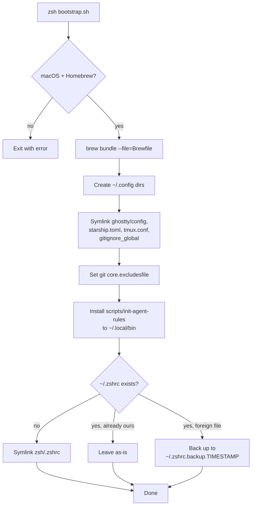
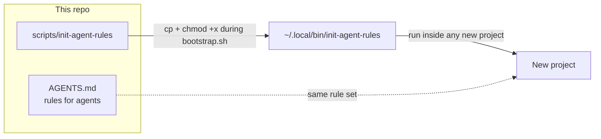

# awesome-dev-setup

<p align="center">
  
  
  
  
  
  
</p>

<p align="center"><b>A minimal, secure, AI-first development environment for macOS.</b></p>

<p align="center">A carefully curated Mac setup for software engineers who want to spend less time configuring their machine and more time building.</p>

<p align="center">
  <a href="#philosophy">Philosophy</a> ·
  <a href="#whats-included">What's included</a> ·
  <a href="#directory-structure">Structure</a> ·
  <a href="#install">Install</a> ·
  <a href="#ai-first-development">AI-first dev</a> ·
  <a href="#security">Security</a> ·
  <a href="#contributing">Contributing</a>
</p>

---

## Philosophy

| Principle | Over |
|---|---|
| 🪶 Minimal | Bloated |
| 🔒 Secure | Convenient |
| ♻️ Reproducible | Manually configured |
| 🧑‍💻 Human-controlled | AI-autonomous |
| ✅ Useful defaults | Endless customization |

## What's included

### Development stack

| Category | Tools |
|---|---|
| 🖥️ Terminal | [Ghostty](https://ghostty.org) |
| ✏️ Editor | [Zed](https://zed.dev) |
| 🐚 Shell | Zsh + [Starship](https://starship.rs) prompt |
| 🪟 Multiplexer | tmux |
| 🤖 AI coding agents | Claude Code, Codex |
| 🧬 Runtime management | [mise](https://mise.jdx.dev) (languages are installed and pinned through mise, not Homebrew) |
| 📦 Containers | Docker Desktop (optional, not installed by `bootstrap.sh`) |
| ☁️ Cloud / orchestration | Kubernetes CLI, Helm, Google Cloud CLI |
| 🗄️ Data stores | PostgreSQL client libs (`libpq`), Redis |

### CLI tools

<p>


</p>

The full, authoritative list always lives in [`Brewfile`](./Brewfile) — treat the table and badges above as a guide, not the source of truth.

## Directory structure

```
.
├── bootstrap.sh              # Entry point: installs packages, symlinks config
├── Brewfile                  # Homebrew formulae + casks
├── AGENTS.md                 # Rules AI coding agents must follow in this repo
├── starship.toml             # Shell prompt configuration
├── .zshrc.local.example      # Template for machine-specific, uncommitted config
├── ghostty/
│   └── config                 # Terminal config, symlinked to ~/.config/ghostty/config
├── git/
│   └── gitignore_global       # Symlinked to ~/.gitignore_global, wired into git config
├── scripts/
│   └── init-agent-rules       # Installed to ~/.local/bin, see "AI-first development" below
├── tmux/
│   └── tmux.conf               # Symlinked to ~/.tmux.conf
└── zsh/
    └── .zshrc                  # Symlinked to ~/.zshrc if one doesn't already exist
```

## Install

**Requirements:** macOS (Apple Silicon or Intel) with [Homebrew](https://brew.sh) installed.

```bash
git clone https://github.com/thecodekaizen/awesome-dev-setup.git
cd awesome-dev-setup
zsh bootstrap.sh
```

### What `bootstrap.sh` actually does



It's idempotent and non-destructive — re-running it is always safe, and it will never silently overwrite a `.zshrc` you already had.

## AI-first development

AI coding agents (Claude Code, Codex) are installed as tools the developer directs — not as an autonomous replacement for the developer. Two pieces enforce that in practice:



- **[`AGENTS.md`](./AGENTS.md)** — the rules any agent operating in this repo (or a repo you apply this setup to) is expected to follow: inspect before changing, keep diffs small and focused, never touch secrets or production credentials, never rewrite Git history or force-push without being asked, run tests/lint before declaring work done, and report what couldn't be verified.
- **`scripts/init-agent-rules`** — installed to `~/.local/bin` by `bootstrap.sh`, this drops a copy of those rules into a new project so agents pick up the same guardrails there.

## Security

- 🚫 The repo itself never contains private keys, API tokens, passwords, `.env` files, cloud credentials, certificates, or machine-specific configuration.
- 🔍 `gitleaks` is installed via the Brewfile so you have a secret-scanning CLI available; run it manually or wire it into CI/pre-commit for your own projects — it is not auto-triggered by anything in this repo.
- 🔑 Machine-specific values (API keys, local paths, anything you don't want in version control) belong in `~/.zshrc.local`, which is sourced by `zsh/.zshrc` but is never committed. Start from `.zshrc.local.example`.

## Reproducibility

Configuration lives in version control so the whole setup can be rebuilt on a new Mac in one command. Anything machine-specific stays in `~/.zshrc.local` and is explicitly kept out of the repo.

## Customize

This is a starting point, not a religion. Fork it, strip out what you don't use, and add your own tools and config.

## What's deliberately missing

| ❌ Excluded | Why |
|---|---|
| Hundreds of aliases | Cognitive overhead outweighs the convenience |
| Random shell plugins | Slower shell startup, more to break |
| Unnecessary background services | Minimal footprint |
| Hard-coded personal paths | Not reproducible on another machine |
| Credentials | Never belong in version control |
| Production configuration | This is a dev environment, not a deploy target |
| Bloat | See: Philosophy |

## Contributing

Private opinions are welcome to become collective improvements. Keep contributions focused and useful, avoid personal configuration, and test `bootstrap.sh` before opening a PR.

## License

[MIT](./LICENSE)
