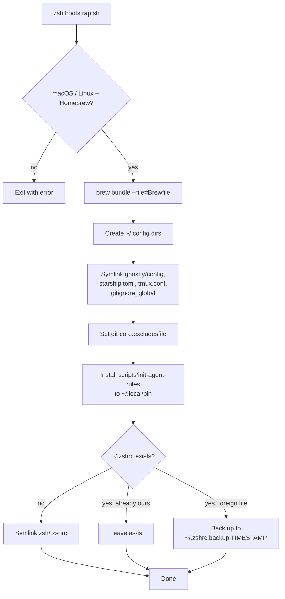
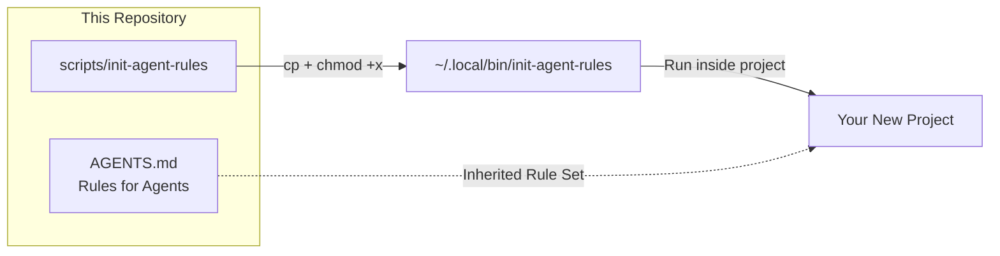

# ⚡ awesome-dev-setup

<div align="center">
  
  
  
  
  
  <br>
  
  
</div>

<h3 align="center">A minimal, secure, AI-first development environment for modern software engineers.</h3>

<p align="center">
  Spend less time wrestling with dotfiles and more time building. <code>awesome-dev-setup</code> provides a meticulously curated, reproducible, and blazing-fast cross-platform (macOS & Linux) environment out of the box.
</p>

---

## 📖 Table of Contents

- [✨ Features](#-features)
- [🚀 Quick Start](#-quick-start)
- [🛠️ The Stack](#-the-stack)
- [📂 Directory Structure](#-directory-structure)
- [🤖 AI-First Development](#-ai-first-development)
- [🔒 Security by Design](#-security-by-design)
- [🎨 Customization](#-customization)
- [🤝 Contributing](#-contributing)
- [📄 License](#-license)

---

## ✨ Features

- **Idempotent & Safe:** Run the bootstrap script as many times as you want. It safely symlinks configurations and never overwrites your existing local `.zshrc`.
- **AI-Native:** Built-in rules and tools for AI coding assistants (Claude Code, Codex) ensuring they write clean code without compromising security.
- **Blazing Fast:** Powered by modern Rust-based CLI tools (`ripgrep`, `fd`, `bat`, `eza`, `starship`).
- **Secure by Default:** Zero secrets in version control. Integrated `gitleaks` prevents you from accidentally pushing API keys.
- **Minimalist:** No bloated Oh-My-Zsh plugins. Only what you need, configured exactly how you want it.

---

## 🚀 Quick Start

**Requirements:** macOS (Apple Silicon or Intel) or Linux, with [Homebrew](https://brew.sh) installed.

```bash
# 1. Clone the repository
git clone https://github.com/thecodekaizen/awesome-dev-setup.git ~/.awesome-dev-setup

# 2. Navigate to the directory
cd ~/.awesome-dev-setup

# 3. Run the bootstrap script
zsh bootstrap.sh
```

### What happens under the hood?


```mermaid
flowchart TD
    A[zsh bootstrap.sh] --> B{macOS / Linux + Homebrew?}
    B -- no --> Z[Exit with error]
    B -- yes --> C[brew bundle --file=Brewfile]
    C --> D[Create ~/.config dirs]
    D --> E["Symlink ghostty/config,\nstarship.toml, tmux.conf,\ngitignore_global"]
    E --> F[Set git core.excludesfile]
    F --> G[Install scripts/init-agent-rules\nto ~/.local/bin]
    G --> H{~/.zshrc exists?}
    H -- "no" --> I[Symlink zsh/.zshrc]
    H -- "yes, already ours" --> J[Leave as-is]
    H -- "yes, foreign file" --> K["Back up to\n~/.zshrc.backup.TIMESTAMP"]
    I --> L[Done]
    J --> L
    K --> L
```

---

## 🛠️ The Stack

We carefully selected best-in-class tools for performance and ergonomics.

| Category | Tools | Description |
|---|---|---|
| 🖥️ **Terminal** | [Ghostty](https://ghostty.org) | Hardware-accelerated, cross-platform native terminal. |
| ✏️ **Editor** | [Zed](https://zed.dev) | High-performance, multiplayer code editor. |
| 🐚 **Shell** | Zsh + [Starship](https://starship.rs) | Extremely fast, customizable prompt. |
| 🪟 **Multiplexer** | tmux | Terminal workspace management. |
| 🤖 **AI Agents** | Claude Code, Codex | Command-line AI coding assistants. |
| 🧬 **Runtimes** | [mise](https://mise.jdx.dev) | Replaces `nvm`, `pyenv`, etc. Fast polyglot tool manager. |
| ☁️ **Cloud Ops** | `kubectl`, `helm`, `gcloud` | Essential orchestration tools. |

### Modern CLI Replacements

Say goodbye to legacy UNIX tools. We use their modern, wildly faster counterparts:

- `ls` ➡️ **`eza`** (with Git integration)
- `cat` ➡️ **`bat`** (with syntax highlighting)
- `find` ➡️ **`fd`** (intuitive and fast)
- `grep` ➡️ **`ripgrep`** (`rg`)
- `cd` ➡️ **`zoxide`** (`z`)

*Check the [`Brewfile`](./Brewfile) for the authoritative list of installed tools.*

---

## 📂 Directory Structure

```text
.
├── bootstrap.sh              # Entry point: installs packages, symlinks config
├── Brewfile                  # Homebrew formulae + casks
├── AGENTS.md                 # Guardrails for autonomous AI coding agents
├── starship.toml             # Shell prompt configuration
├── .zshrc.local.example      # Template for uncommitted, machine-specific config
├── ghostty/                  # Hardware-accelerated terminal config
├── git/                      # Global gitignore and git settings
├── scripts/                  # Utility scripts (agent init, setup validation)
├── tmux/                     # Multiplexer configuration
└── zsh/                      # Core shell configuration
```

---

## 🤖 AI-First Development

AI is treated as a highly capable peer, not a replacement. We enforce strict guardrails for any AI agent interacting with this setup.


```mermaid
flowchart LR
    subgraph This Repository
        AG[AGENTS.md<br/>Rules for Agents]
        SC[scripts/init-agent-rules]
    end
    SC -- "cp + chmod +x" --> LB["~/.local/bin/init-agent-rules"]
    LB -- "Run inside project" --> NP["Your New Project"]
    AG -. "Inherited Rule Set" .-> NP
```

Run `init-agent-rules` in any new project to automatically inject **[`AGENTS.md`](./AGENTS.md)**. This ensures that whether you are using Claude Code, Codex, or Cursor, the AI:
- Keeps changes small and focused.
- **Never** exposes secrets or touches production credentials.
- Leaves Git history intact (no `--force` pushes).
- Always runs tests/linters before finishing work.

---

## 🔒 Security by Design

Security isn't an afterthought—it's baked in.

- **Zero Secrets in Git:** This repository contains absolutely no private keys, `.env` files, or API tokens.
- **Local Overrides:** Anything sensitive belongs in `~/.zshrc.local`. We provide a template (`.zshrc.local.example`), and `.gitignore` guarantees your local secrets never get pushed.
- **Automated Scanning:** `gitleaks` is installed by default, giving you a powerful CLI to scan for accidentally committed secrets in any project you work on.

---

## 🎨 Customization

This repository is designed to be a foundation, not a strict religion. You are highly encouraged to fork it and make it your own!

1. Fork the repository.
2. Update the `Brewfile` with your preferred tools.
3. Modify `zsh/.zshrc` or `starship.toml` to fit your workflow.
4. Keep your machine-specific configurations (like work vs. personal Git emails) in `~/.zshrc.local`.

---

## 🤝 Contributing

We welcome contributions! If you have a tool or workflow improvement that aligns with our philosophy, we'd love to see it.

1. Fork the repo and create your branch (`git checkout -b feat/amazing-tool`).
2. Keep the scope minimal and focused.
3. Ensure you test `bootstrap.sh` locally before submitting.
4. Open a Pull Request!

---

## 📄 License

This project is licensed under the MIT License - see the [LICENSE](./LICENSE) file for details.

<div align="center">
  <b>Built with ❤️ by engineers who love shipping.</b>
</div>
